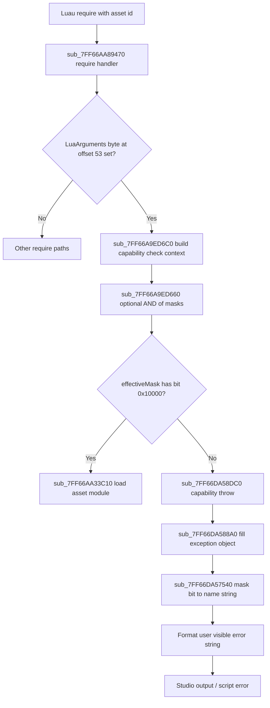

# How LoadUnownedAsset Is blocked by Roblox

## 1. Introduction

This document explains how Roblox Studio blocks **`require`** when the thread that lacks the **LoadUnownedAsset** capability.

**Target:** `RobloxStudioBeta.exe`  
**IDA image base:** `0x7FF667500000`  
**Build:** `version-792bc2069be7464a`

**Roblox Error:**

```text
The current thread cannot require using asset ID lacking capability LoadUnownedAsset  -  Server - SandBoxed:1
```

**In a nutshell:** Your script calls `require` with a number. Roblox enters the sandbox asset id path, builds one 64 bit effective capability mask for the running thread, and tests bit **0x10000**. SandBoxed server threads do not have that bit set, so the check fails. Native code at `sub_7FF66AA89470` calls the capability throw helper and never loads the module. The throw helper passes the missing bit to `sub_7FF66DA57540`, which maps **0x10000** to **LoadUnownedAsset** in the Roblox console.

---

## 2. FlowChart



**RVA quick map**

| RVA | Symbol / role |
|-----|----------------|
| `0x5A89470` | Main **`require`** handler |
| `0x5A9ED6C0` | Allocate capability check context |
| `0x5A9ED660` | Compute effective mask by AND chain |
| `0x5A895A8` | Call site into throw helper on failure |
| `0x2A58DC0` | Capability throw |
| `0x2A588A0` | Populate exception fields |
| `0x2A57540` | Decode single set bit to capability name |
| `0x5A33C10` | Asset require loader on success path |

**String VAs on this database:**

| VA | Text |
|----|------|
| `0x7FF6709F2778` | `require using asset ID` |
| `0x7FF6711372A0` | `lacking capability` |
| `0x7FF670980FD8` | `LoadUnownedAsset` |
| `0x7FF6711372BC` | `The current thread cannot %s '%s' %s %s` |

---

## 3. In depth Explanation

### 3.1 Luau calls require
The script passes a **number** as the module specifier. Roblox routes that into the native **`require`**

The native entry for this build is **`sub_7FF66AA89470`** at RVA **`0x5A89470`**.

---

### 3.2 sub_7FF66AA89470 require handler

**Job:** Parse Luau arguments, decide which require implementation runs.

| Field | Offset | Type | Meaning |
|-------|--------|------|---------|
| Lua argument wrapper pointer | varies | pointer | First argument object |
| Sandbox asset require flag | **+53** | **byte** | Non-zero → asset id sandbox path |

When the byte at **offset 53** is set, execution continues into capability checking.

**Failure path outline:**

1. Call **`sub_7FF66A9ED6C0`** with the active **`lua_State`**.
2. Receive a **capability check context** pointer, called **`ctx`** here.
3. If **`ctx+0x30`** holds a callback pointer, invoke it to refresh **`ctx+0x28`**.
4. Read **`effectiveMask`** from **`ctx+0x28`**, an eight byte QWORD.
5. Test **`effectiveMask & 0x10000`**. Zero → throw at RVA **`0x5A895A8`**.

**Success path:** Call **`sub_7FF66AA33C10`** at RVA **`0x5A33C10`** to perform the actual asset load.

---

### 3.3 sub_7FF66A9ED6C0 build check context

**Job:** Create a small object that ties the current thread, script, and capability callback together for one enforcement check.

**Typical layout inferred from decompilation:**

| Offset | Size | Role |
|--------|------|------|
| `+0x18` | 8 | Pointer related to script / VM state |
| `+0x28` | 8 | **Effective capability mask** QWORD, decompiler index **`ctx[5]`** |
| `+0x30` | 8 | Optional initializer callback |

The mask at **`+0x28`** is what **3.2** tests against **`0x10000`**.

---

### 3.4 sub_7FF66A9ED660 effective mask AND chain

**Job:** Shrink the thread capability mask by intersecting every registered filter.

| Location | Offset | Content |
|----------|--------|---------|
| Script context object | **+0x48** | Base capability QWORD, eight bytes |
| Global default table | **`unk_7FF6739B01A8`** | Default filter masks when script has no override |
| Per script filter list | walked from script metadata | Each entry supplies an AND mask |

SandBoxed server scripts under reduced containers keep **`0x10000`** clear in the effective mask, so asset id **`require`** always fails the bit test.

---

### 3.5 Bit test at 0x5A89590 and 0x5A895A8

**Job:** Read **`effectiveMask`** from **`ctx+0x28`** and decide whether this thread may continue to the asset loader or must throw.

| RVA | Role |
|-----|------|
| **`0x5A89590`** | **`test`** bit **`0x10000`** on QWORD at **`ctx+0x28`**, branch on zero |
| **`0x5A895A8`** | Failure path: **`call`** **`sub_7FF66DA58DC0`** |

| Throw argument | Value |
|----------------|--------|
| Missing mask | **`0x10000`** |
| Operation | **`require using asset ID`** |
| Name slots | null |

This is the final gate inside **`sub_7FF66AA89470`** after **3.3** and **3.4** fill the mask. A set bit lets execution reach **`sub_7FF66AA33C10`** at **`0x5A33C10`**. A clear bit stops at **`0x5A895A8`** and never touches the asset service. SandBoxed server scripts almost always fail here because **3.4** already left **`0x10000`** off in **`ctx+0x28`**.

---

### 3.6 sub_7FF66DA58DC0 capability throw

**RVA:** `0x2A58DC0`  
**Behavior:** Builds a C++ exception and does not return to the caller.

This is where all errors of capabilties come from Loadstring, WritePlayer ect

**Callee chain:**

1. **`sub_7FF66DA588A0`**: fill structured exception record  
2. **`sub_7FF66DA57540`**: resolve **`firstMissingName`** string  
3. Formatting helpers and **`_CxxThrowException`**

---

### 3.7 sub_7FF66DA588A0 exception record

**Job:** Write fields used by the Luau error formatter.

| Field | Source for this failure |
|-------|-------------------------|
| `operation` | **`require using asset ID`** |
| `firstMissingName` | Output of **`sub_7FF66DA57540`** on mask **`0x10000`** |
| `name` | Often empty for this path |

---

### 3.8 sub_7FF66DA57540 bit to capability name

**RVA:** `0x2A57540`  
**Input:** A mask with **one** bit set, the missing capability.  

**Bits on my evil build:**

| Mask bit | Name |
|----------|------|
| `0x10000` | **LoadUnownedAsset** |
| `0x100000000000` | **LoadOwnedAsset** |
| `0x20000` | **LoadString** |
| `0x20` | **NotAccessible** |

---

### 3.9 Throws an error

```text
The current thread cannot %s '%s' %s %s
```

Filled roughly as:

| Slot | Value |
|------|--------|
| 1 | `require` |
| 2 | `require using asset ID` |
| 3 | `lacking capability` |
| 4 | `LoadUnownedAsset` |

---

### 3.10 Success!!!!!!!!!!! sub_7FF66AA33C10

Only can be reached if **`effectiveMask & 0x10000 != 0`**.

---

## 4. End Credits

Research and writeup: **Several** and **Setmetatables**.
Thanks for reading :3
