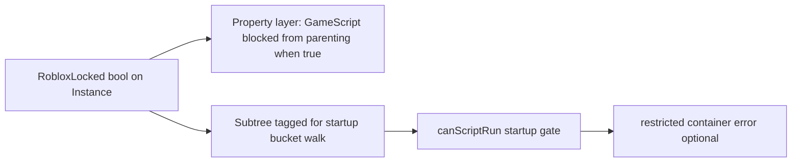
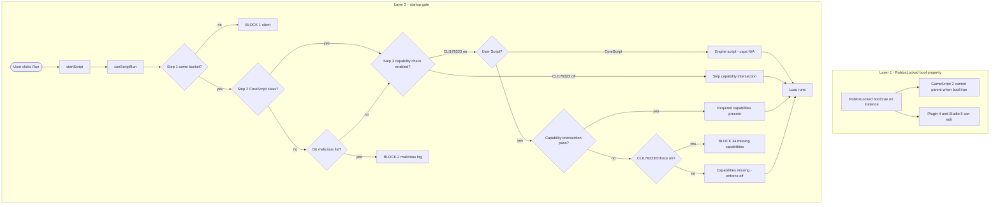
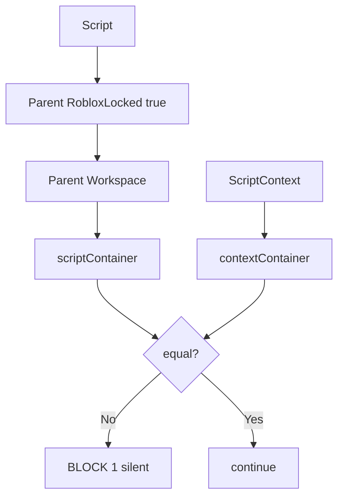
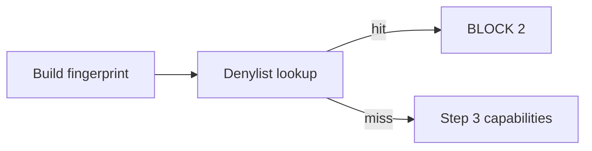
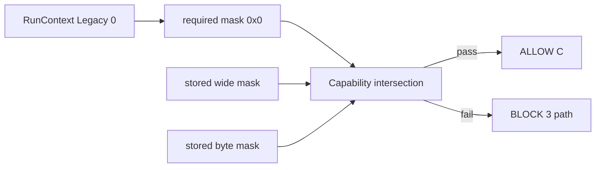
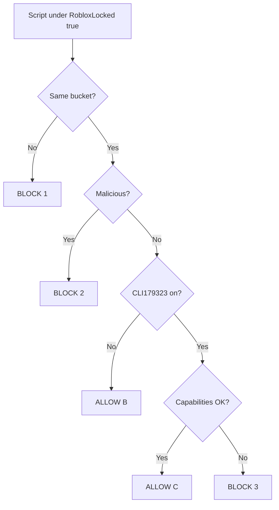

# RobloxLocked Analysis

Studio error:

> Script "Workspace..Script" was blocked from being ran under a restricted container.

**Build analyzed:** recent `RobloxStudioBeta.exe` (Studio)

---

## 1. What is RobloxLocked

**RobloxLocked** is a **bool property** on `Instance`. In the properties panel and reflection API it appears as `RobloxLocked`.

**What it does:** When **RobloxLocked** is **true** on an instance, low-trust script identities cannot treat that instance (or its subtree) like normal game content. It cannot be referenced, destroyed, or created through normal GameScript APIs in the usual way.

**Who is blocked:** **GameScript** identity (level 2) — normal `Script` and `LocalScript` in a place.

**Who is not blocked:** **Plugin** (4), **Studio** (5), engine **CoreScript**, and other higher contexts.

**What the bool does not do by itself:** Setting **RobloxLocked** to **true** does not print the restricted-container error. That message comes from a separate startup gate before Luau runs.



---

## 2. Things you need to know

Read this before the flowchart. Three **different** systems are involved; mixing them up is the main source of confusion.

The **RobloxLocked** bool uses **property descriptors** with high security (PluginSecurity-class read/write). That is **not** the same as the startup **capability** bitmasks below.

### 2.1 Container bucket (startup — territory match)

Before Luau runs, the engine asks: **does the script live in the same security territory as the runner?**

| Term | Meaning |
|------|---------|
| **scriptContainer** | Internal pointer after walking **up** `.Parent` from the **script** |
| **contextContainer** | Internal pointer after resolving the **ScriptContext** runner |
| **Bucket match** | `scriptContainer == contextContainer` (same address) |

When **RobloxLocked** is **true** on an ancestor, the script’s walk resolves a **restricted** container pointer. That does **not** automatically block startup; the script can still start if the runner’s container pointer matches.

### 2.2 Startup capabilities (startup — bitmask on ScriptContext)

Controlled by Studio **FFlags**. When **CLI179323** is **on**, the engine checks whether the **ScriptContext** already holds the capability bits required for this script’s **RunContext**.

| FFlag | Role |
|-------|------|
| **CLI179323** | Master switch: run the capability gate at script start |
| **CLI179323Enforce** | If **capability intersection** fails, only when this is **on** does Studio block startup and show the restricted-container error |

### 2.3 Required masks (RunContext on the script)

The startup gate reads **RunContext** on the script instance and maps it to a **required capability mask**.

| RunContext | Level | Required mask | Typical script |
|------------|-------|---------------|----------------|
| **Legacy** | **0** | **`0x0`** | Workspace `Script` under an instance with **RobloxLocked** **true** |
| Server | 1 | `0x2000000000000003` | ServerScript |
| Client | 2 | `0x0` | LocalScript |
| **Plugin** | **3** | **`0x300000000000000B`** | PluginScript |
| 5 | 5 | `0x2000000000000001` | — |
| 6 | 6 | `0x700000000000000B` | — |
| 7, 8 | 7–8 | `0x200000000000003F` | — |
| 9, 0xD | 9, 13 | `0xC` | — |
| 10 | 10 | `0x6000000000000003` | — |
| 11 | 11 | `0x2000000000000000` | — |
| 12 | 12 | `0x1000000000000000` | — |

### 2.4 Stored masks (what must match required)

**Capability intersection** compares the required mask to masks stored on the **ScriptContext**:

| Location | Field |
|----------|--------|
| Script context inner object **`+0x208` (520)** | Wide capability mask (QWORD) |
| Script context object **`+0x198`** | Narrow capability mask (BYTE) |

**Pass rule:**

```
wideOK  = (storedWide == 0) OR ((required & storedWide) == storedWide)
byteOK  = (storedByte == 0) OR ((required & storedByte) == storedByte)
PASS    = wideOK AND byteOK
```

For **Legacy** (`required = 0`), the stored masks must still satisfy these rules. If intersection **fails**, you get **BLOCK 3** even when the bucket matched.

---

## 3. Full flowchart

Read top to bottom. **Property layer** (left) is separate from **startup gate** (right).  
If **canScriptRun** passes, Luau starts; otherwise the script is blocked.



### What each box means

| Box | Explanation |
|-----|-------------|
| **Layer 1** | **RobloxLocked** bool property: who may **parent** or **edit** instances where the bool is **true** (`printidentity`). Does **not** call **canScriptRun**. |
| **Layer 2** | **canScriptRun**: may this script **start**? |
| **Step 1** | Container bucket. **RobloxLocked** **true** on a parent changes `scriptContainer`. Edit-mode Run often fails here (silent). |
| **Step 2** | Malicious hash denylist. Different log text than restricted-container. |
| **Step 3** | **Startup capabilities.** **RunContext** → **required mask** (2.3), compared to **stored masks** (2.4) via **capability intersection**. |
| **Skip capability intersection** | **CLI179323** off — capabilities are not checked at start (bucket + not malicious still required). |
| **Required capabilities present** | Intersection **pass** — **ScriptContext** has the bits needed for this **RunContext**. |
| **Capabilities missing - enforce off** | Intersection **failed**, **CLI179323Enforce** off — no restricted-container error and no capability block at startup. **BLOCK 1** may still apply. Not the same as having correct capabilities. |
| **BLOCK 3a missing capabilities** | Intersection **failed**, **CLI179323Enforce** on — blocked with the restricted-container error. |
| **Engine script** | **CoreScript**: malicious and capability checks are skipped in step 3. |
| **Your Workspace Script** | Under an instance with **RobloxLocked** **true**: GameScript 2, Legacy **RunContext**, required mask `0x0`. Needs bucket match plus capabilities OK (or **CLI179323** off). |

---

## 4. Explanation of everything

### 4.0 Schedule — `startScript`

Engine entry: **`startScript`** calls **`canScriptRun`** before the Luau VM starts.

Nothing is blocked yet. Inputs: script pointer, **RunContext**, and which **ScriptContext** owns the run.

---

### 4.1 ALLOW A — CoreScript

| Requirement | |
|-------------|--|
| Instance class is **CoreScript** (engine script, not a user `Script`) | |
| **Bucket compare still runs** | Must match like any other script |
| Malicious / capability gates | Skipped inside steps 2–3, then **Luau runs** |

Internal engine code does not use the user-script denylist or capability failure paths. Your Workspace `Script` is **not** CoreScript—you need **ALLOW B** or **C**.

---

### 4.2 BLOCK 1 — Wrong bucket

**Chart diamond:** `scriptContainer != contextContainer`

#### Walk up `.Parent` (how territory is chosen)

Example tree (**RobloxLocked** bool **true** on the folder):

```
DataModel
└── Workspace
    └── Folder (RobloxLocked = true)
        └── Script   ← Run
```

**Script side:**

1. `Script` → parent with **RobloxLocked** **true**
2. That parent → `Workspace`
3. `Workspace` is a **ServiceProvider** → stop; store **scriptContainer**

**Runner side:** the same walk from **ScriptContext** → **contextContainer**.



---

### 4.3 BLOCK 2 — Malicious hash

**Chart diamond:** fingerprint on denylist

- **Check:** 32-character hex fingerprint vs denylist on **ScriptContext**
- **Log:** `detected as malicious` — not the restricted-container message
- **Explaination:** 9000+ Hashes that are detected then blocked from running

**Typical trace:** buckets matched; denylist **not** hit.



---

### 4.4 ALLOW B — FFlag CLI179323 off

**Chart diamond:** **CLI179323** **off** → skip capability gate

| Must already pass | |
|-------------------|--|
| Not **CoreScript** | |
| Buckets **match** | |
| Not on malicious denylist | |
| **CLI179323** **off** | |

Capabilities are **not** checked. The script can start if the bucket matches.

---

### 4.5 ALLOW C — FFlag CLI179323 on + capabilities OK

**Chart diamond:** capability intersection **PASS**

| Must already pass | |
|-------------------|--|
| Buckets **match** | |
| Not on malicious denylist | |
| **CLI179323** **on** | |
| **Capability intersection** **PASS** | |

#### What “capabilities OK” means



| RunContext | Required mask | Meaning |
|------------|---------------|---------|
| **Legacy (0)** | `0x0` | Pass intersection rules for zero required bits |
| **Plugin (3)** | `0x300000000000000B` | Stored masks must cover plugin bits |
| Server / Client | See table 2.3 | Stricter than Legacy |

For a user `Script` with **RobloxLocked** **true** and **Legacy** **RunContext**, the realistic path when enforcement is on: **bucket match + capability intersection pass**.

---

### 4.6 BLOCK 3 / 3a — Missing startup capabilities

**Chart diamond:** **CLI179323** **on** and intersection **FAIL**

| Variant | CLI179323Enforce | Result |
|---------|------------------|--------|
| **3a** | **on** + capabilities **missing** | Blocked + restricted-container error |
| **Capabilities missing, enforce off** | **off** + capabilities **missing** | Not blocked for capabilities; no restricted-container log |

If the script still does not run with enforce off, check **BLOCK 1** (edit vs play **ScriptContext**), not BLOCK 3a.

#### Live trace (script under **RobloxLocked** **true**)

| Field | Result |
|-------|--------|
| **RobloxLocked** bool | **true** on ancestor |
| Luau identity | **GameScript 2** (property layer) |
| RunContext | **Legacy 0** → required mask **`0x0`** |
| Buckets | **Matched** |
| Malicious denylist | **Not hit** |
| CLI179323 | **On** |
| Capability intersection | **Failed** |
| CLI179323Enforce | **Off** → no restricted-container log from capabilities; if the script still never runs, suspect **BLOCK 1** |

---

### 4.7 Plugin scripts (ALLOW B or C)

Not a separate chart branch. **Plugin** **RunContext (3)** still requires:

1. **Bucket match**
2. **Not** on malicious denylist
3. **ALLOW B** (**CLI179323** off) **or** **ALLOW C** (**on** + plugin mask `0x300000000000000B` satisfied)

---

### 4.8 Checklist — user `Script` under **RobloxLocked** **true**

| # | Requirement | Layer |
|---|-------------|-------|
| 1 | Not **CoreScript** | Startup |
| 2 | `scriptContainer == contextContainer` | Bucket |
| 3 | Not on malicious denylist | Startup |
| 4a | **Or** **CLI179323** off | ALLOW B |
| 4b | **Or** **CLI179323** on + capability intersection **PASS** | ALLOW C |
| — | **GameScript 2** cannot parent into instances where **RobloxLocked** is **true** | Bool property |
| — | **Plugin 4 / Studio 5** can edit those instances | Bool property |



---

## 5. References

- [Pseudoreality/Roblox-Identities](https://github.com/Pseudoreality/Roblox-Identities/) — Luau identity levels (GameScript 2, Plugin 4, Studio 5)

---

Thanks for reading. Several and Setmetatables was here :3 baiiiiiiiiii
